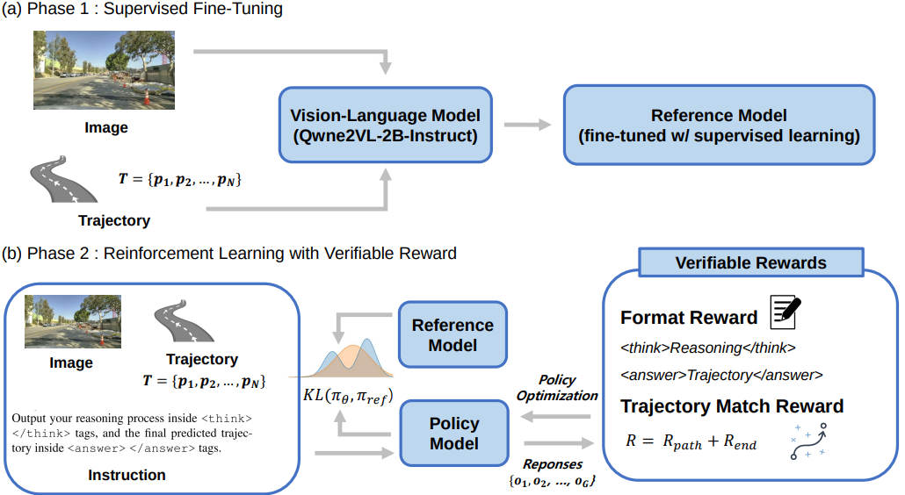
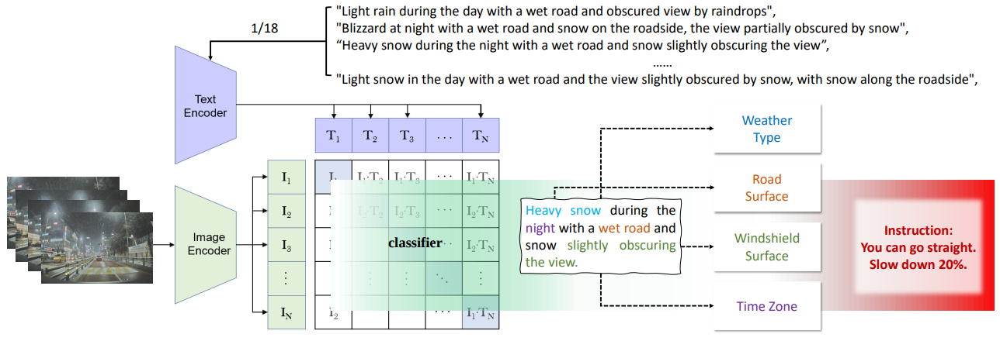
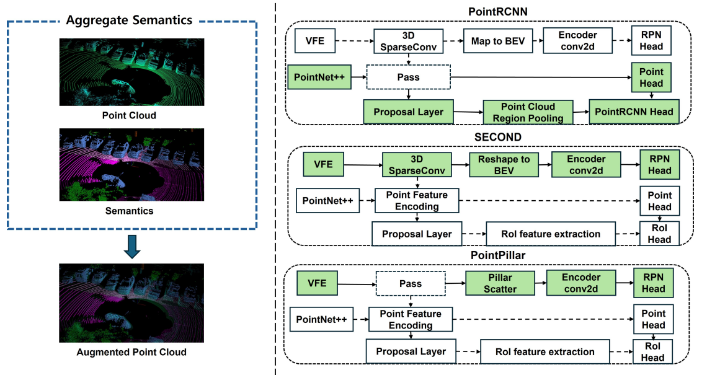

I am a post-master researcher at ETRI, working on LLM agents and vision-language-action alignment for autonomous driving. My research focuses on incorporating those to enable interpretable and robust end-to-end autonomous driving. You can see my Curriculum Vitae [here](../assets/curriculum_vitae_HayeonOh.pdf).

Email : **oph516@etri.re.kr** or **gkdus9595@hanyang.ac.kr**

## Publications
- 

    

      <b>LaViPlan: Language-Guided Visual Path Planning with RLVR</b> 
      <u>Hayeon Oh</u> 
      <i>International Conference on Computer Vision (<b>ICCV</b>) 2025 Workshop on the Challenge Of Out Of Label Hazards In Autonomous Driving</i> 
      <a href="https://arxiv.org/abs/2507.12911">preprint</a>
    

    
  

- 

    

      <b>SADWA: Fine-Grained Weather Awareness with Vision-Language Models for Seamless Autonomous Driving in Real Time</b> 
      Jinwoo Kim, <u>Hayeon Oh</u>, Youngmin Oh, Kyounghwan An, Donghwan Lee 
      <i>International Conference on Computer Vision (<b>ICCV</b>) 2025 Workshop on the Challenge Of Out Of Label Hazards In Autonomous Driving</i>
    

    
  

- 

    

      <b>SeSame: Simple, Easy 3D Object Detection with Point-Wise Semantics</b> 
      <u>Hayeon Oh</u>, Chanuk Yang, Kunsoo Huh 
      <i>Asian Conference on Computer Vision (<b>ACCV</b>) 2024</i> 
      <a href="https://github.com/OPhD-hahao/SeSame">github</a> | <a href="https://openaccess.thecvf.com/content/ACCV2024/html/O_SeSame_Simple_Easy_3D_Object_Detection_with_Point-Wise_Semantics_ACCV_2024_paper.html">paper</a>
    

    
  

## Work Experience

- **Post-Master’s Researcher**, ETRI, Feb.2025 - Current
- **Research Intern**, ETRI, Jan.2023 - Feb.2023
- **Research Intern**, ETRI, Jul.2022 - Aug.2022

## Honors and Awards

- Special Prize in the Autonomous Electric Vehicle Competition (Oct.2022) [(link)](https://www.motorgraph.com/news/articleView.html?idxno=30990)
- Hanyang Brain Schoarship (2019S, 2019F, 2020S, 2022F)

## Educations

- Mar.2023 - Feb.2025 : Hanyang University, M.S in Automotive Engineering advised by [Prof. Kunsoo Huh](https://archi.hanyang.ac.kr/src/lab_mmc.php).
- Mar.2019 - Feb.2023 : Hanyang University (ERICA), B.S in Electrical Engineering. (Cum Laude)

<!-- Trigger rebuild -->
