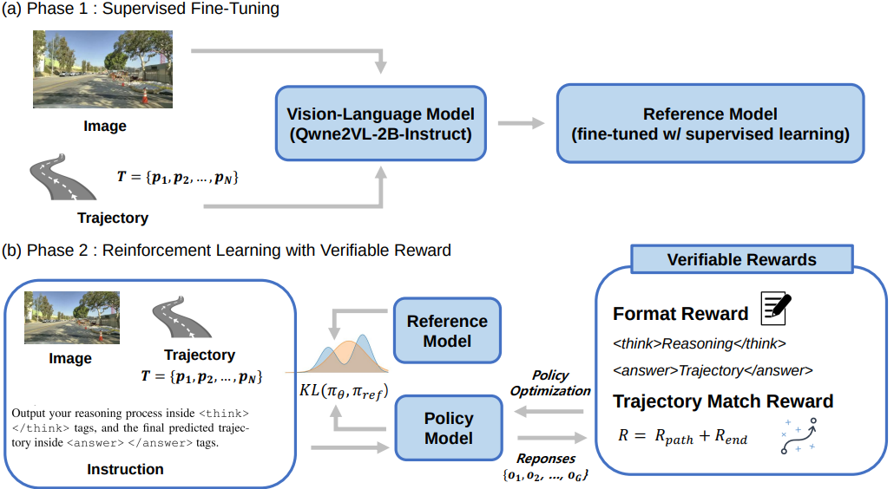
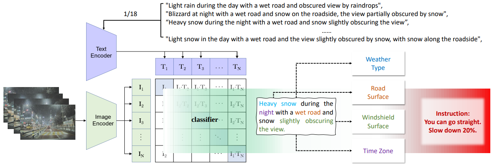
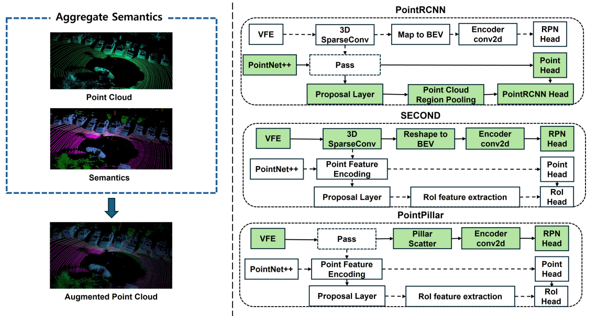
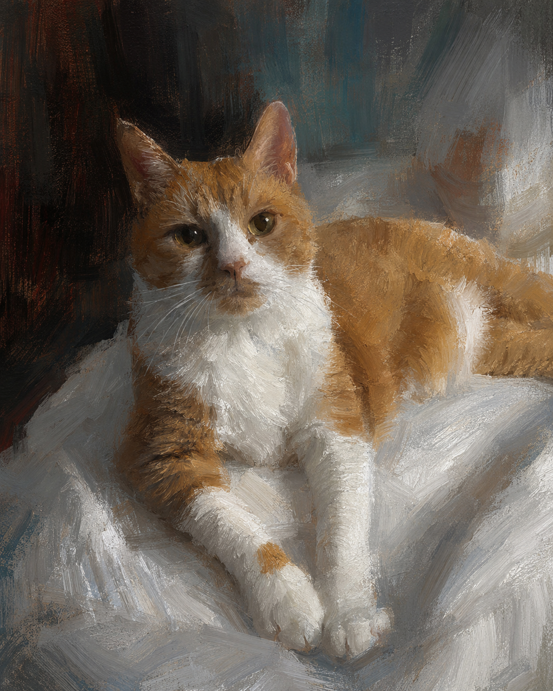
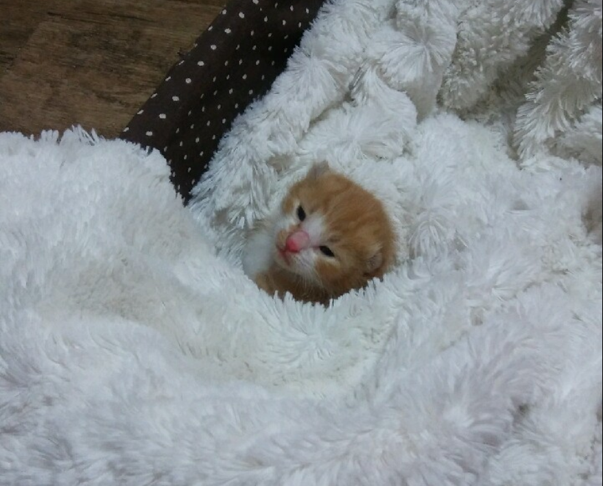

I'm a PhD student at Korea Advanced Institute of Science and Technology (KAIST), advised by [Prof. Donghwan Lee](https://scholar.google.com/citations?user=OpuJ-i4AAAAJ&hl=en). My research focuses on developing adaptive and uncertainty-aware Vision-Language-Action models for autonomous driving and robotics, with an emphasis on latent reasoning, metacognition-driven reasoning adaptation, and safe decision-making.

#### Publications

---

    

      <b>Teaching VLMs What to Say, Not How to Reason: Rethinking Counterfactual Reasoning in Autonomous Driving</b> 
      <u>Hayeon Oh</u>, Donghwan Lee 
      <i>Advances in Neural Information Processing Systems (NeurIPS), 2026</i> 
      <a href="">paper</a> | <a href="https://github.com/OPhD-hahao/Rethink-CF">github</a>  | <a href="">project page</a> 
    

    <!--  -->

    

      <b>LaViPlan: Language-Guided Visual Path Planning with RLVR</b> 
      <u>Hayeon Oh</u> 
      <i>IEEE/CVF International Conference on Computer Vision Workshops (ICCVW), 2025</i> 
      <a href="https://openaccess.thecvf.com/content/ICCV2025W/2COOOL/html/Oh_LaViPlan__Language-Guided_Visual_Path_Planning_with_RLVR_ICCVW_2025_paper.html">paper</a> | <a href="https://github.com/OPhD-hahao/LaViPlan">github</a>
    

    <!--  -->

    

      <b>SADWA: Fine-Grained Weather Awareness with Vision-Language Models for Seamless Autonomous Driving in Real Time</b> 
      Jinwoo Kim, <u>Hayeon Oh</u>, Youngmin Oh, Kyounghwan An, Donghwan Lee 
      <i>IEEE/CVF International Conference on Computer Vision Workshops (ICCVW), 2025 <b>(best paper award)</b></i>  
      <a href="https://openaccess.thecvf.com/content/ICCV2025W/2COOOL/html/Kim_SADWA_Fine-Grained_Weather_Awareness_with_Vision-Language_Models_for_Seamless_Autonomous_ICCVW_2025_paper.html">paper</a>
    

    <!--  -->
  

    

      <b>SeSame: Simple, Easy 3D Object Detection with Point-Wise Semantics</b> 
      <u>Hayeon Oh</u>, Chanuk Yang, Kunsoo Huh 
      <i>Asian Conference on Computer Vision (ACCV) 2024</i> 
      <a href="https://openaccess.thecvf.com/content/ACCV2024/html/O_SeSame_Simple_Easy_3D_Object_Detection_with_Point-Wise_Semantics_ACCV_2024_paper.html">paper</a> | <a href="https://github.com/OPhD-hahao/SeSame">github</a>
    

    <!--  -->
  

#### Research Experience

---

<ul style="font-size: 0.95em; line-height: 1.4; list-style-type: disc; padding-left: 20px;">
  <!-- <li><strong>NVIDIA</strong>
    <ul style="list-style-type: circle; padding-left: 20px;">
      <li>2030.09 - 2031.09 : Research Scientist</li>
      <li>2028.03 - 2028.09 : Research Intern</li>
    </ul>
  </li> -->
  <!-- <li><strong>University of Tübingen</strong>
    <ul style="list-style-type: circle; padding-left: 20px;">
      <li>2029.01 - 2029.12 : Visiting Student (advisor: Andreas Geiger)</li>
    </ul>
  </li> -->
  <li><strong>Electronics and Telecommunications Research Institute (ETRI)</strong>
    <ul style="list-style-type: circle; padding-left: 20px;">
      <li>2025.02 - 2025.12 : Post-Master Researcher</li>
      <li>2023.01 - 2023.02 : Research Intern</li>
      <li>2022.07 - 2022.08 : Research Intern</li>
    </ul>
  </li>
</ul>

#### Honors and Awards

---

<ul style="font-size: 0.95em; line-height: 1.4;">
  <li> Gold Reviewer @ ICML 2026</li>
  <li>Special Prize in the Autonomous Vehicle Competition (Oct. 2022) <a href="https://www.motorgraph.com/news/articleView.html?idxno=30990">(link)</a></li>
  <li>Hanyang Brain Schoarship (2019S, 2019F, 2020S, 2022F)</li>
</ul>

#### Educations

---

<ul style="font-size: 0.95em; line-height: 1.4;">
  <li>2026.09 - current : KAIST, Ph.D in Electrical Engineering</li>
  <li>2023.03 - 2025.02 : Hanyang University, M.S in Automotive Engineering</li>
  <li>2019.03 - 2023.02 : Hanyang University, B.S in Electrical Engineering (ERICA, Cum Laude)</li>
</ul>

#### Academic Services

---

- Conference Reviewer : ICML 2026, NeurIPS 2026, AAAI 2027
- Journal Reviewer : IEEE T-IV

#### Misc

---

I love dark lore

- Game : Blasphemous, FAITH: The Unholy Trinity, Diablo (IV), Fear and Hunger (I & II), Look Outside

- Anime : Chiikawa, Hellsing

and my research assistant

  
  
  <!-- 

    Greetings, Hooman.   I'm orange and boy cat.   My primary area of academic research is focused on the development and consumption of chicken-flavored delicacies.
  
 -->

  Hello, hooman. I'm Tory, super-mega-giga-chad orange boy cat.  
  I eat tons of chicken treats to get protein. 
  My research interest is focusing on how to make her bankrupt.
  
  

